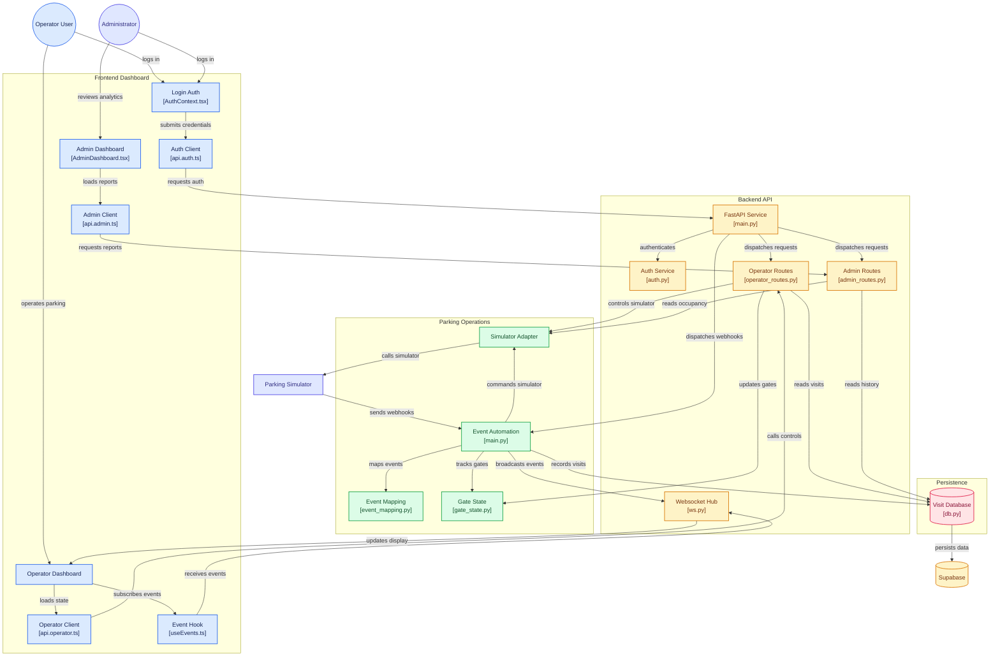

# Parkflow.

## Setup

1. Download/unzip the Park Simulator and place the `ParkingSimulator-win-x64` folder directly at the **repo root** (as a sibling of `backend/` and `frontend/`). It's gitignored, so this step is manual for everyone who clones the repo.

   The backend expects it at exactly this path:
   ```
   hackmyiot/
   ├── ParkingSimulator-win-x64/
   │   ├── ParkingSimulator.exe
   │   └── settings/
   │       ├── settings.json
   │       └── lvl1.json
   ├── backend/
   └── frontend/
   ```

2. In `backend/`, copy `.env.example` to `.env` and fill in your Supabase credentials (`SUPABASE_URL`, `SUPABASE_SECRET_KEY`).

3. In `ParkingSimulator-win-x64/settings/settings.json`, set `WebhookUrl` to `http://localhost:8000/webhook`.

4. Run the backend:
   ```
   cd backend
   uv sync
   uv run uvicorn main:app --port 8000 --app-dir src
   ```

5. Run the simulator (`ParkingSimulator.exe`) alongside it.

## Project Structure

